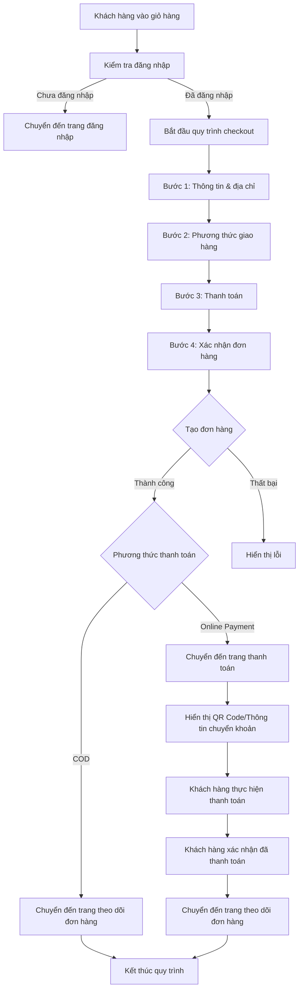
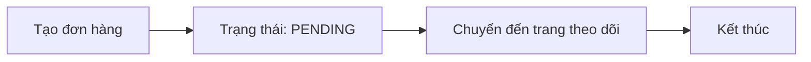
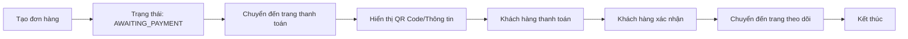

# Bản đồ thanh toán của trang web Mẹ Phương Thịt Heo

## 🏗️ Tổng quan hệ thống thanh toán

Hệ thống thanh toán của trang web được thiết kế theo mô hình **Multi-step Checkout** với 4 bước chính và hỗ trợ nhiều phương thức thanh toán.

## 📊 Sơ đồ luồng thanh toán



## 🔄 Chi tiết từng bước thanh toán

### 1. **Bước 1: Thông tin & địa chỉ** (`Step1InfoAddress`)
- **Mục đích**: Thu thập thông tin khách hàng và địa chỉ giao hàng
- **Dữ liệu thu thập**:
  - Họ và tên
  - Số điện thoại
  - Email
  - Địa chỉ giao hàng
  - Ghi chú (tùy chọn)
- **Validation**: Kiểm tra các trường bắt buộc
- **Chuyển tiếp**: Sau khi hoàn thành → Bước 2

### 2. **Bước 2: Phương thức giao hàng** (`Step2Shipping`)
- **Mục đích**: Chọn phương thức và thời gian giao hàng
- **Tùy chọn giao hàng**:
  - Giao hàng tiêu chuẩn: 30,000đ (2-3 ngày)
  - Giao hàng nhanh: 50,000đ (1 ngày)
  - Miễn phí giao hàng: Đơn hàng từ 500,000đ
- **Chuyển tiếp**: Sau khi chọn → Bước 3

### 3. **Bước 3: Thanh toán** (`Step3Payment`)
- **Mục đích**: Chọn phương thức thanh toán và áp dụng mã giảm giá
- **Phương thức thanh toán**:
  - **COD**: Thanh toán khi nhận hàng
  - **BANKING**: Chuyển khoản ngân hàng
  - **MOMO**: Ví điện tử MoMo
  - **ZALOPAY**: Ví điện tử ZaloPay
- **Mã giảm giá**:
  - WELCOME10: Giảm 10% cho khách hàng mới
  - SAVE20: Giảm 20% cho đơn hàng từ 300,000đ
  - FREESHIP: Miễn phí giao hàng
  - VIP15: Giảm 15% cho khách hàng VIP
- **Chuyển tiếp**: Sau khi chọn → Bước 4

### 4. **Bước 4: Xác nhận đơn hàng** (`Step4Confirmation`)
- **Mục đích**: Xem lại thông tin và xác nhận đặt hàng
- **Hiển thị**:
  - Thông tin khách hàng
  - Thông tin giao hàng
  - Phương thức thanh toán
  - Danh sách sản phẩm
  - Tóm tắt thanh toán
- **Hành động**: Nhấn "Đặt hàng" để tạo đơn hàng

## 💳 Luồng xử lý thanh toán

### **COD (Cash on Delivery)**


### **Thanh toán Online (Banking/MoMo/ZaloPay)**


## 🗂️ Cấu trúc file và API

### **Frontend Components**
```
components/checkout/
├── Step1InfoAddress.tsx    # Bước 1: Thông tin khách hàng
├── Step2Shipping.tsx       # Bước 2: Phương thức giao hàng
├── Step3Payment.tsx        # Bước 3: Thanh toán
└── Step4Confirmation.tsx   # Bước 4: Xác nhận
```

### **Pages**
```
app/
├── cart/page.tsx           # Trang giỏ hàng
├── checkout/page.tsx       # Trang checkout chính
├── payment/[orderId]/page.tsx  # Trang thanh toán
└── order-tracking/page.tsx # Trang theo dõi đơn hàng
```

### **API Endpoints**
```
app/api/
├── orders/route.ts         # Tạo đơn hàng
├── account/orders/route.ts # Quản lý đơn hàng user
├── discount/route.ts       # Xử lý mã giảm giá
└── webhook/payment/        # Webhook thanh toán
```

## 🔧 Tính năng hỗ trợ

### **Mã giảm giá**
- **API**: `/api/discount` (POST)
- **Validation**: Kiểm tra điều kiện áp dụng
- **Types**: Phần trăm, số tiền cố định, miễn phí ship

### **QR Code**
- **Endpoint**: `/api/qr-code?data={method}&amount={amount}`
- **Hỗ trợ**: Banking, MoMo, ZaloPay
- **Format**: QR code động theo số tiền

### **Webhook**
- **Path**: `/api/webhook/payment/`
- **Mục đích**: Xử lý callback từ gateway thanh toán
- **Chức năng**: Cập nhật trạng thái đơn hàng

## 📱 Trạng thái đơn hàng

| Trạng thái | Mô tả | Hành động tiếp theo |
|------------|-------|-------------------|
| `PENDING` | Chờ xử lý (COD) | Đóng gói và giao hàng |
| `AWAITING_PAYMENT` | Chờ thanh toán | Hiển thị QR code |
| `PAID` | Đã thanh toán | Đóng gói và giao hàng |
| `PROCESSING` | Đang xử lý | Chuẩn bị hàng |
| `SHIPPED` | Đã giao hàng | Theo dõi vận chuyển |
| `DELIVERED` | Đã giao thành công | Hoàn tất |
| `CANCELLED` | Đã hủy | Kết thúc |

## 🛡️ Bảo mật và Validation

### **Authentication**
- Kiểm tra đăng nhập trước khi checkout
- Sử dụng `authenticateUser` middleware
- Header `x-user-id` cho API calls

### **Validation**
- Kiểm tra giỏ hàng không trống
- Validate thông tin khách hàng bắt buộc
- Kiểm tra tồn kho sản phẩm
- Validate mã giảm giá

### **Error Handling**
- Toast notifications cho user feedback
- Console logging cho debugging
- Graceful error handling
- Fallback redirects

## 🎯 User Experience

### **Progress Indicator**
- Hiển thị 4 bước với icon và trạng thái
- Cho phép quay lại bước trước
- Validation real-time
- Visual feedback cho từng bước

### **Responsive Design**
- Mobile-first approach
- Grid layout cho desktop
- Touch-friendly buttons
- Optimized cho mobile checkout

---

*Sơ đồ này được tạo dựa trên phân tích codebase thực tế của dự án Mẹ Phương Thịt Heo*
