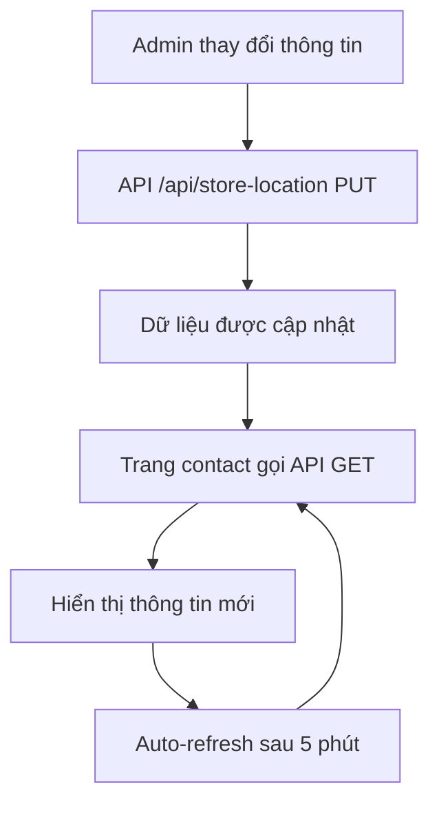

# Hướng dẫn Tự động Cập nhật Thông tin Cửa hàng

## 🎯 **Vấn đề đã được giải quyết**

Trước đây, trang contact hiển thị thông tin cửa hàng được hardcode, không tự động cập nhật khi admin thay đổi thông tin. Bây giờ đã được sửa để tự động đồng bộ với dữ liệu từ API.

## ✅ **Tính năng mới**

### **1. Tự động cập nhật thông tin**
- Trang contact tự động lấy thông tin từ API `/api/store-location`
- Khi admin thay đổi thông tin, trang contact sẽ hiển thị dữ liệu mới
- Fallback về dữ liệu mặc định nếu API không hoạt động

### **2. Auto-refresh**
- Tự động refresh dữ liệu mỗi 5 phút
- Đảm bảo thông tin luôn được cập nhật
- Không cần reload trang

### **3. Loading states**
- Hiển thị loading khi đang tải thông tin
- Smooth transition khi dữ liệu được cập nhật

## 🔧 **Cách hoạt động**

### **API Integration**
```typescript
// Trang contact tự động gọi API
const { storeLocation, loading } = useStoreLocation()

// Hiển thị thông tin động
<p className="text-gray-600">{storeLocation?.phone || "0902 759 466"}</p>
```

### **Custom Hook**
```typescript
// hooks/useStoreLocation.ts
export function useStoreLocation() {
  const [storeLocation, setStoreLocation] = useState<StoreLocation | null>(null)
  const [loading, setLoading] = useState(true)
  
  // Auto-refresh every 5 minutes
  useEffect(() => {
    const interval = setInterval(() => {
      fetchStoreLocation()
    }, 5 * 60 * 1000)
    
    return () => clearInterval(interval)
  }, [])
  
  return { storeLocation, loading, error, refetch }
}
```

## 📱 **Thông tin được cập nhật**

### **Thông tin liên hệ**
- ✅ **Số điện thoại**: `storeLocation?.phone`
- ✅ **Email**: `storeLocation?.email`
- ✅ **Địa chỉ**: `storeLocation?.address`
- ✅ **Giờ làm việc**: `storeLocation?.workingHours`

### **Thao tác nhanh**
- ✅ **Gọi điện**: `tel:${storeLocation?.phone}`
- ✅ **Gửi email**: `mailto:${storeLocation?.email}`
- ✅ **Bản đồ**: Sử dụng địa chỉ từ API

### **Bản đồ**
- ✅ **Địa chỉ**: `storeLocation?.address`
- ✅ **Marker**: Tự động cập nhật vị trí
- ✅ **Info window**: Hiển thị thông tin mới

## 🚀 **Cách test**

### **1. Thay đổi thông tin trong admin**
```bash
# Truy cập admin
http://localhost:3000/admin/store-location/edit

# Thay đổi:
- Số điện thoại: 0902 759 466 → 0123 456 789
- Email: support@mephuong.com → info@mephuong.com
- Địa chỉ: Thêm "Số 123" vào đầu địa chỉ
```

### **2. Kiểm tra trang contact**
```bash
# Truy cập trang contact
http://localhost:3000/contact

# Kiểm tra:
- Thông tin liên hệ đã cập nhật
- Bản đồ hiển thị địa chỉ mới
- Nút "Gọi ngay" và "Gửi email" sử dụng thông tin mới
```

### **3. Test auto-refresh**
- Đợi 5 phút hoặc thay đổi thông tin trong admin
- Refresh trang contact
- Thông tin sẽ tự động cập nhật

## 🔄 **Luồng hoạt động**



## 🛠️ **Cấu trúc Code**

### **Trang Contact** (`app/contact/page.tsx`)
```typescript
export default function ContactPage() {
  const { storeLocation, loading } = useStoreLocation()
  
  return (
    <div>
      {/* Thông tin động */}
      <p>{storeLocation?.phone || "0902 759 466"}</p>
      <p>{storeLocation?.email || "support@mephuong.com"}</p>
      <p>{storeLocation?.address || "Default address"}</p>
      
      {/* Bản đồ động */}
      <GoogleMap address={storeLocation?.address} />
    </div>
  )
}
```

### **Custom Hook** (`hooks/useStoreLocation.ts`)
```typescript
export function useStoreLocation() {
  const [storeLocation, setStoreLocation] = useState<StoreLocation | null>(null)
  const [loading, setLoading] = useState(true)
  
  const fetchStoreLocation = async () => {
    const response = await fetch('/api/store-location')
    const result = await response.json()
    
    if (result.success) {
      setStoreLocation(result.data)
    } else {
      // Fallback to default data
      setStoreLocation(defaultStoreData)
    }
  }
  
  // Auto-refresh every 5 minutes
  useEffect(() => {
    const interval = setInterval(fetchStoreLocation, 5 * 60 * 1000)
    return () => clearInterval(interval)
  }, [])
  
  return { storeLocation, loading, error, refetch: fetchStoreLocation }
}
```

## 🔐 **Error Handling**

### **API Failover**
- Nếu API không hoạt động → Fallback về dữ liệu mặc định
- Nếu network error → Hiển thị dữ liệu cached
- Nếu parsing error → Log error và sử dụng fallback

### **Loading States**
- Hiển thị loading spinner khi đang tải
- Smooth transition khi dữ liệu được cập nhật
- Không block UI khi refresh

## 📊 **Performance**

### **Optimizations**
- **Caching**: Dữ liệu được cache trong state
- **Debouncing**: Tránh gọi API quá nhiều lần
- **Background refresh**: Không block UI khi refresh
- **Fallback**: Luôn có dữ liệu để hiển thị

### **Memory Management**
- Cleanup intervals khi component unmount
- Proper state management
- No memory leaks

## 🎨 **UI/UX Improvements**

### **Loading States**
```typescript
{storeLoading ? (
  <div className="loading-spinner">
    <div className="animate-spin">Đang tải thông tin...</div>
  </div>
) : (
  <div className="store-info">
    {/* Thông tin cửa hàng */}
  </div>
)}
```

### **Smooth Transitions**
- Fade in/out khi dữ liệu thay đổi
- Loading states không làm gián đoạn UX
- Consistent styling

## 🔮 **Tương lai**

### **Tính năng có thể thêm:**
- [ ] Real-time updates với WebSocket
- [ ] Push notifications khi có thay đổi
- [ ] Version control cho thông tin cửa hàng
- [ ] Audit log cho các thay đổi
- [ ] Multi-language support
- [ ] A/B testing cho thông tin cửa hàng

### **Optimizations:**
- [ ] Service Worker caching
- [ ] Offline support
- [ ] Progressive loading
- [ ] Image optimization

---

**Kết quả**: Bây giờ khi admin thay đổi thông tin cửa hàng trong admin panel, trang contact sẽ tự động hiển thị thông tin mới mà không cần reload trang!
